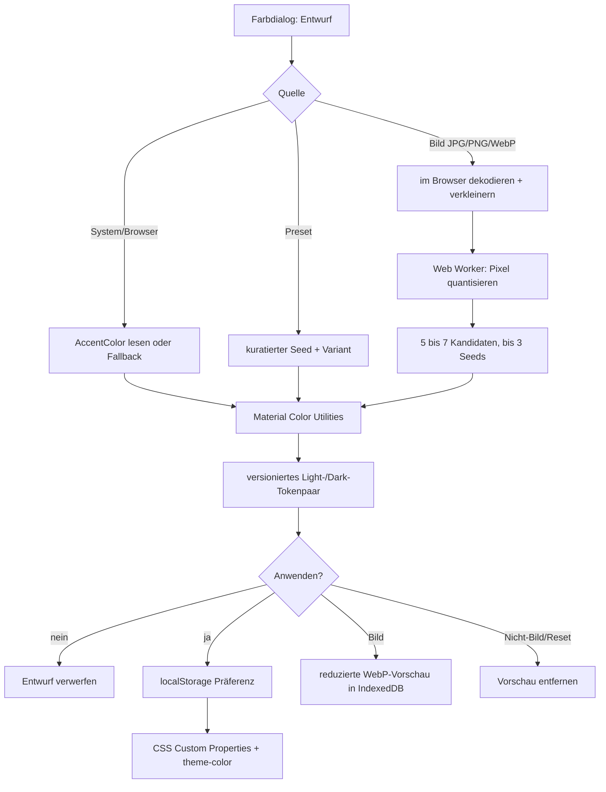

# Appearance und Designsystem

> **Zielgruppe:** Frontend-, Designsystem- und Accessibility-Entwickler.
> **Zweck und Lernziel:** Farben, Tokens, Fonts, Bildanalyse und visuelle Rollen konsistent weiterentwickeln.
> **Voraussetzungen:** [Frontend](frontend.md)
> **Kanonisch für:** Appearance-Persistenz, Palettengenerierung, Designtokens, Typografie und visuelle Rollen.
> **Verwandte Dokumente:** [Tests und Qualität](tests-und-qualitaet.md), [Fonts](../fonts/README.md), [ADR 0008](../entscheidungen/0008-material-design-und-dynamische-farben.md)

## Mentales Modell

Appearance ist eine eigene lokale Domäne: Eine versionierte Präferenz wählt Modus (`system`, `light`, `dark`), Farbquelle (`browser`, Preset oder Bild), Palette und ein vollständiges Light-/Dark-Tokenpaar. Die Finanzdomäne kennt diese Wahl nicht. Stabile Finanzsemantik – positiv/frei, Rücklage, Schuld/Achtung – bleibt von dekorativen Primärfarben getrennt.

## Quellen und Modi

Der Browser-Akzent ist ein optionaler CSS-Hinweis und keine zuverlässige Android-Wallpaper-Erkennung. Fehlt er, verwendet `accura` deterministisch Petrol/Teal. Neun kuratierte Material-You-Presets bieten reproduzierbare Alternativen. Systemmodus folgt `prefers-color-scheme`; explizit Hell oder Dunkel ignoriert OS-Wechsel.

## Appearance- und Wallpaper-Verarbeitung

Implementierung und Tests: [src/components/ColorThemeDialog.tsx](../../src/components/ColorThemeDialog.tsx), [src/appearance/imagePalette.ts](../../src/appearance/imagePalette.ts), [src/appearance/palette.worker.ts](../../src/appearance/palette.worker.ts), [src/appearance/wallpaperStore.ts](../../src/appearance/wallpaperStore.ts), [src/appearance/imagePalette.test.ts](../../src/appearance/imagePalette.test.ts), [src/appearance/wallpaperStore.test.ts](../../src/appearance/wallpaperStore.test.ts).

## Lokale Bildgrenze

Nur bewusst gewählte JPG-, PNG- oder WebP-Dateien werden verarbeitet. Dekodierung, Verkleinerung, Quantisierung und Palettengenerierung bleiben im Browser; das Original wird nicht hochgeladen oder dauerhaft gespeichert. Höchstens eine reduzierte WebP-Vorschau liegt in IndexedDB. Generationen/Abbruchlogik verhindern, dass eine verspätete Analyse eine neuere Auswahl überschreibt. Beim Wechsel zu Nicht-Bild-Farben, Entfernen oder Reset wird die Vorschau gelöscht.

## Speichervertrag

`finance-appearance-v1` in `localStorage` enthält Version 1, Modus, Quelle, Palettenmetadaten, normalisierte Hex-Seeds, komplettes Theme-Paar und Wallpaper-Metadaten. Ungültige Daten fallen auf Standard zurück. Ein gleichnamiger, aber technisch separater IndexedDB-Speicher hält die Bildvorschau. Ein `storage`-Listener synchronisiert Präferenzen zwischen Tabs. Logout ändert Appearance nicht.

## Farben und Tokens

`src/design/tokens.css` definiert zentrale CSS Custom Properties für Page-/Container-Ebenen, Text, Outline, Primär-/Sekundärrollen, Finanzsemantik, Abstände, Formen, Typografie und Motion. Normale Inhalte nutzen tonale Elevation; Schatten sind auf Navigation und Modalflächen begrenzt. Dark Mode verwendet keine rein schwarzen Content-Flächen.

Die Layoutgeometrie folgt einer 4-Pixel-Basis. Typische Außenradien sind Hero 36 px, Section 28 px, verschachtelte Karte 20 px und gruppierte Liste 24 px. Der innere Radius folgt `max(0px, outer radius - inset distance)`. Interaktive Ziele sind mindestens 48 px, zentrale Aktionen 56 px.

## Typografie

Google Sans Flex v22 wird lokal/offline als variable Schrift mit Latin und Latin Extended eingebunden. Sichtbare Rollen verwenden `ROND: 100`, automatische optische Größe und tabellarische Ziffern für Geld. Produktinformation liegt nicht unter 12 px. Geldwerte bleiben in normalen UI-Flächen vollständig und exakt: Hero- und Kennzahlenwerte bleiben einschließlich Währung einzeilig und skalieren innerhalb ihrer festen Wertfläche kontinuierlich mit der formatierten Länge; andere enge Flächen verwenden kontrollierte Umbruchstellen zwischen Zahlengruppen und vor der Währung. Nur direkte Diagrammlabel und Achsen dürfen kompakt runden; Tooltip und zugängliche Zusammenfassung behalten den exakten Betrag. Herkunft und SIL OFL 1.1 stehen unter [Fonts](../fonts/README.md).

## Motion und Barrierefreiheit

Schnelle, Standard- und langsame Übergänge verwenden zentralisierte 120/180/240-ms-Rollen. `prefers-reduced-motion` entfernt räumliche Bewegung. Forced Colors und sichtbare Fokusindikatoren werden in Responsive-Styles berücksichtigt. Dynamische Paletten müssen Text-/UI-Kontraste bewahren; Golden- und Axe-Prüfung sind in [Tests und Qualität](tests-und-qualitaet.md) kanonisch beschrieben.

## Grenzen

Browserfarben können fehlen oder sich unerwartet ändern; deshalb existiert der Fallback. Bildpaletten sind heuristisch und nicht semantisch. IndexedDB kann ausfallen, sodass eine Palette ohne Vorschau dennoch aktiv bleibt. Ein Theme ist Darstellung, kein Schutz der Finanzdaten.

## Begründung und Nachweis

Siehe [ADR 0008](../entscheidungen/0008-material-design-und-dynamische-farben.md).

- Provider/Store: [src/appearance/AppearanceProvider.tsx](../../src/appearance/AppearanceProvider.tsx), [src/appearance/appearanceStore.ts](../../src/appearance/appearanceStore.ts)
- Theme-Erzeugung: [src/appearance/themePalettes.ts](../../src/appearance/themePalettes.ts), [src/appearance/themeTokens.ts](../../src/appearance/themeTokens.ts)
- Styles: [src/design/tokens.css](../../src/design/tokens.css), [src/styles](../../src/styles)
- Tests: [src/appearance](../../src/appearance), [src/design](../../src/design)
