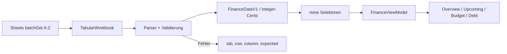
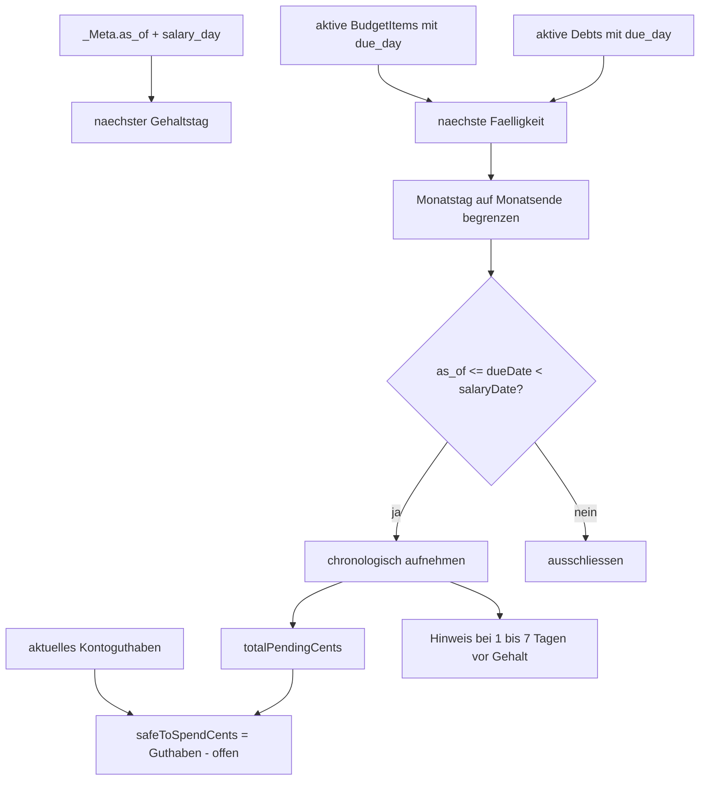

# Finanz-Domäne

> **Zielgruppe:** Entwickler, die Berechnungen und Finance-Daten verfolgen.
> **Zweck und Lernziel:** Einen Tabellenwert durch Parser, Domänentypen, Selektoren und View-Model bis zur UI verfolgen.
> **Voraussetzungen:** [Datenvalidierung und Speicher](../grundlagen/daten-validierung-und-speicher.md), [Finance Data Schema v1](../referenz/finance-data-schema-v1.md)
> **Kanonisch für:** Cent-Berechnungen, Snapshot-Auswahl, Selektoren, View-Model und Demnächst-Formeln.
> **Verwandte Dokumente:** [Synchronisation und Offline](synchronisation-und-offline.md), [ADR 0010](../entscheidungen/0010-gehaltsbezogene-faelligkeitsprojektion.md)

## Mentales Modell

Die Tabelle enthält Quellen und zeitbezogene Snapshots, keine UI-Gesamtsummen. Der Parser validiert Beziehungen und normalisiert Geld in Integer-Cents. Reine Selektoren wählen den fachlich gültigen Stand und berechnen Summen. Das View-Model ergänzt lokalisierte Texte und Screen-Strukturen. React rendert diese Ausgabe.

## Sheets- und Finance-Datenpipeline

Implementierung und Tests: [api/_lib/google.ts](../../api/_lib/google.ts), [src/finance/parser.ts](../../src/finance/parser.ts), [src/finance/selectors.ts](../../src/finance/selectors.ts), [src/finance/viewModel.ts](../../src/finance/viewModel.ts), [src/finance/parser.test.ts](../../src/finance/parser.test.ts).

## Integer-Cents und Snapshots

Ein Euro-Quellwert `x` wird als `sign(x) × round((abs(x) + Number.EPSILON) × 100)` normalisiert und muss ein sicherer JavaScript-Integer sein. Danach rechnen Selektoren ausschließlich in Cents. Ratenanzahlen bleiben separate Ganzzahlen.

Für aktive Konten, Pockets und Schulden wird der jeweils jüngste Snapshot mit `snapshot.asOf <= FinanceDataV1.asOf` gewählt. `_Meta.as_of` ist damit fachlicher Stichtag und nicht die aktuelle Browser-Uhr. Aktive Entitäten ohne passenden Snapshot machen das Workbook ungültig.

## Gehaltsbezogene Fälligkeitsprojektion

Implementierung und Tests: [src/finance/upcoming.ts](../../src/finance/upcoming.ts), [src/finance/upcoming.test.ts](../../src/finance/upcoming.test.ts), [src/screens/UpcomingScreen.tsx](../../src/screens/UpcomingScreen.tsx), [src/screens/UpcomingScreen.test.ts](../../src/screens/UpcomingScreen.test.ts).

Verbindliche Regeln:

1. Berechnungsstichtag ist `data.asOf` aus `_Meta.as_of`.
2. `salaryDay` bestimmt den nächsten Gehaltstag; `dueDay` die nächste monatlich wiederkehrende Fälligkeit.
3. Ein Tag 29–31 wird in kürzeren Monaten auf deren letzten gültigen Tag begrenzt, einschließlich Schaltjahr.
4. Nur aktive Budgetpositionen und Schulden mit `dueDay` werden berücksichtigt.
5. Das Intervall ist inklusive Stichtag, aber exklusiv Gehaltstag: `asOf <= dueDate < nextSalaryDate`.
6. Zahlungen am Gehaltstag zählen nicht zur offenen Summe davor.
7. `totalPendingCents` ist die Summe der aufgenommenen Beträge.
8. `currentlyAvailableCents` ist das aktuelle Kontoguthaben; `safeToSpendCents = currentlyAvailableCents - totalPendingCents`.
9. „Kurz vor Gehalt“ gilt für Fälligkeiten strikt vor dem Gehalt und innerhalb der vorherigen sieben Kalendertage.
10. Ohne gültigen `salaryDay` gibt es kein nächstes Gehaltsdatum und keine offene Projektion.

`UpcomingPaymentV1` trägt ID, Name, Centbetrag, Fälligkeitstag/-datum, Quelle und Hinweisflag. `UpcomingSummaryV1` bündelt Gehaltstag/-datum, Zahlungen und die drei Summen. Die exakten Typen stehen in [src/finance/types.ts](../../src/finance/types.ts).

## View-Model und Grenzen

Das View-Model erzeugt die vier Screenmodelle gemeinsam; dadurch teilen UI und Tests dieselbe Ableitung. Es ist eine Projektion, keine Speicherung. Der zentrale discriminated `budgetStatus` unterscheidet `empty` ohne aktive Budgetpositionen, `within-budget` mit nicht negativem Saldo und `overdrawn` mit positivem Fehlbetrag. Alle Varianten enthalten geplante Summe, vorzeichenbehafteten Budgetsaldo und die Auslastung in Basis Points. Bei Einkommen kleiner oder gleich null ist diese Auslastung `null`; ein negativer Budgetsaldo wird weder für Anzeige noch zugängliche Zusammenfassungen auf null begrenzt. Alle Beträge werden bis zur Präsentationsgrenze in Integer-Cents berechnet.

Die Demnächst-Logik nimmt monatliche Wiederholung an und berücksichtigt weder einmalige Termine noch Feiertags-/Bankarbeitstagverschiebungen. Negative `safeToSpendCents` sind möglich und werden nicht künstlich auf null begrenzt. Dasselbe gilt für reale negative Konto- und Pocketstände sowie den daraus abgeleiteten aktuellen Gesamtbestand.

## Begründung

Siehe [ADR 0002](../entscheidungen/0002-versionierte-domaenengrenze-und-integer-cents.md), [ADR 0006](../entscheidungen/0006-provider-selektoren-und-view-model.md) und [ADR 0010](../entscheidungen/0010-gehaltsbezogene-faelligkeitsprojektion.md).
