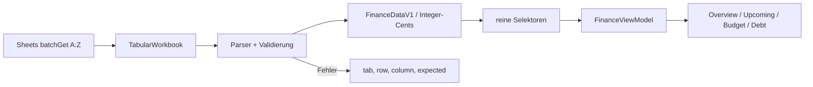
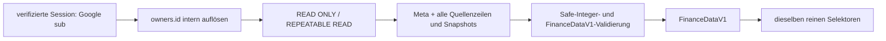
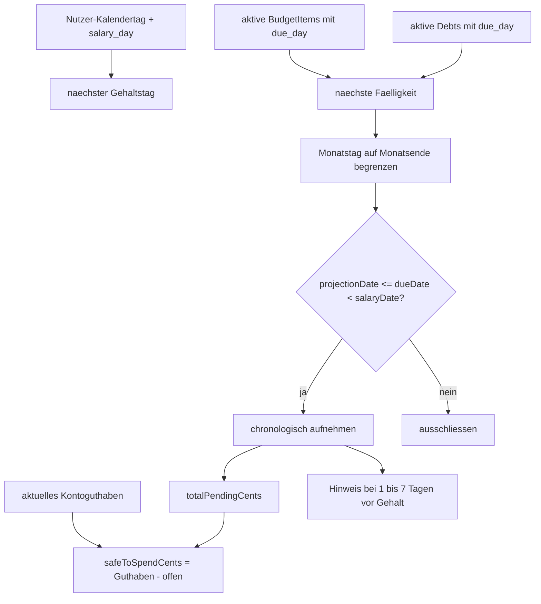

# Finanz-Domäne

> **Zielgruppe:** Entwickler, die Berechnungen und Finance-Daten verfolgen.
> **Zweck und Lernziel:** Einen Tabellenwert durch Parser, Domänentypen, Selektoren und View-Model bis zur UI verfolgen.
> **Voraussetzungen:** [Datenvalidierung und Speicher](../grundlagen/daten-validierung-und-speicher.md), [Finance Data Schema v1](../referenz/finance-data-schema-v1.md)
> **Kanonisch für:** Cent-Berechnungen, Snapshot-Auswahl, Selektoren, View-Model und Demnächst-Formeln.
> **Verwandte Dokumente:** [Synchronisation und Offline](synchronisation-und-offline.md), [ADR 0010](../entscheidungen/0010-gehaltsbezogene-faelligkeitsprojektion.md)

## Mentales Modell

Die Tabelle enthält Quellen und zeitbezogene Snapshots, keine UI-Gesamtsummen. Der Parser validiert Beziehungen und normalisiert Geld in Integer-Cents. Reine Selektoren wählen den fachlich gültigen Stand und berechnen Summen. Das View-Model ergänzt lokalisierte Texte und Screen-Strukturen. React rendert diese Ausgabe.

`FinanceDataV1` ist die quellenunabhängige Domänengrenze: Der einmalige Sheet-Import wird später denselben Vertrag erzeugen wie das bereits implementierte PostgreSQL-Repository. Die produktive API verwendet im aktuellen Übergangsstand weiterhin Sheets; der PostgreSQL-Reader ist nur intern und in Integrationstests erreichbar. Quelle, Owner-Zuordnung und SQL-Grenze legt [ADR 0013](../entscheidungen/0013-postgresql-als-finanzquelle.md) fest.

## Aktuelle Sheets- und Finance-Datenpipeline

Implementierung und Tests: [api/_lib/google.ts](../../api/_lib/google.ts), [src/finance/parser.ts](../../src/finance/parser.ts), [src/finance/selectors.ts](../../src/finance/selectors.ts), [src/finance/viewModel.ts](../../src/finance/viewModel.ts), [src/finance/parser.test.ts](../../src/finance/parser.test.ts).

## PostgreSQL-Abbildung im Übergangsstand

Die Tabellen `finance_meta`, `accounts`, `account_snapshots`, `pockets`, `pocket_snapshots`, `budget_items`, `debts`, `debt_snapshots`, `debt_milestones` und `relief_milestones` entsprechen den zehn v1-Quellbereichen. `owner_id` ist reine Persistenzinformation und wird nicht Teil des Domänenobjekts. Geld bleibt `BIGINT` in Cents; Meilensteine speichern Monats-/Tagespräzision separat und werden wieder als `YYYY-MM` beziehungsweise `YYYY-MM-DD` ausgegeben.

Das Repository liest bewusst jeden gespeicherten Snapshot einschließlich alter und zukünftiger Werte. Es wählt keinen „aktuellen“ Stand und berechnet keine Summe. Erst die unveränderten Selektoren verwenden `snapshot.asOf <= data.asOf`. Damit bleibt die fachliche Auswahlgrenze identisch zum Sheets-Pfad. Die Datenbank erzwingt strukturelle Owner-/Fremdschlüsselintegrität; das Repository ergänzt Laufzeitvertrag und die Parserregel, dass aktive Accounts, Pockets und Debts einen passenden Snapshot benötigen.

Vollständiger Tabellenvertrag: [Datenbankreferenz](../referenz/datenbank.md). Implementierung und echter Datenbanktest: [financeRepository.ts](../../api/_lib/financeRepository.ts), [financeRepository.postgres.test.ts](../../tests/postgres/financeRepository.postgres.test.ts). Dieselbe Suite hält Cents, `salaryDay`/`dueDay` und die Selektor-Auswahl `selectLatest*Snapshot` der anonymen Fixture zwischen Parser und Reader fest.

## Integer-Cents und Snapshots

Ein Euro-Quellwert `x` wird als `sign(x) × round((abs(x) + Number.EPSILON) × 100)` normalisiert und muss ein sicherer JavaScript-Integer sein. Danach rechnen Selektoren ausschließlich in Cents. Ratenanzahlen bleiben separate Ganzzahlen.

Für aktive Konten, Pockets und Schulden wird der jeweils jüngste Snapshot mit `snapshot.asOf <= FinanceDataV1.asOf` gewählt. `_Meta.as_of` ist damit fachlicher Stichtag und nicht die aktuelle Browser-Uhr. Fehlende Zwischenmonate werden nicht interpoliert. Aktive Entitäten ohne passenden Snapshot machen das Workbook ungültig.

Dieser Datenstichtag ist vom Projektionstag getrennt. Wiederkehrende Fälligkeiten werden ab dem aktuellen Kalendertag in der IANA-Zeitzone des Nutzers projiziert. Die UI ermittelt diesen Tag explizit und übergibt ihn an das View-Model; ein veralteter Snapshot hält dadurch bereits vergangene Fälligkeiten nicht künstlich offen.

## Gehaltsbezogene Fälligkeitsprojektion

Implementierung und Tests: [src/finance/upcoming.ts](../../src/finance/upcoming.ts), [src/finance/upcoming.test.ts](../../src/finance/upcoming.test.ts), [src/screens/UpcomingScreen.tsx](../../src/screens/UpcomingScreen.tsx), [src/screens/UpcomingScreen.test.ts](../../src/screens/UpcomingScreen.test.ts).

Verbindliche Regeln:

1. Projektionstag ist der aktuelle Kalendertag in der IANA-Zeitzone des Nutzers. `data.asOf` bleibt ausschließlich Daten- und Snapshot-Stichtag.
2. `salaryDay` bestimmt den nächsten Gehaltstag; `dueDay` die nächste monatlich wiederkehrende Fälligkeit.
3. Ein Tag 29–31 wird in kürzeren Monaten auf deren letzten gültigen Tag begrenzt, einschließlich Schaltjahr.
4. Nur aktive Budgetpositionen und Schulden mit `dueDay` werden berücksichtigt.
5. Das Intervall ist inklusive Projektionstag, aber exklusiv Gehaltstag: `projectionDate <= dueDate < nextSalaryDate`.
6. Zahlungen am Gehaltstag zählen nicht zur offenen Summe davor.
7. `totalPendingCents` ist die Summe der aufgenommenen Beträge.
8. `currentlyAvailableCents` ist das aktuelle Kontoguthaben; `safeToSpendCents = currentlyAvailableCents - totalPendingCents`.
9. „Kurz vor Gehalt“ gilt für Fälligkeiten strikt vor dem Gehalt und innerhalb der vorherigen sieben Kalendertage.
10. Ohne gültigen `salaryDay` gibt es kein nächstes Gehaltsdatum und keine offene Projektion.

`UpcomingPaymentV1` trägt ID, Name, Centbetrag, Fälligkeitstag/-datum, Quelle und Hinweisflag. `UpcomingSummaryV1` bündelt Gehaltstag/-datum, Zahlungen und die drei Summen. Die exakten Typen stehen in [src/finance/types.ts](../../src/finance/types.ts).

## View-Model und Grenzen

Das View-Model erzeugt die vier Screenmodelle gemeinsam; dadurch teilen UI und Tests dieselbe Ableitung. Es ist eine Projektion, keine Speicherung. Der zentrale discriminated `budgetStatus` unterscheidet `empty` ohne aktive Budgetpositionen, `within-budget` mit nicht negativem Saldo und `overdrawn` mit positivem Fehlbetrag. Alle Varianten enthalten geplante Summe, vorzeichenbehafteten Budgetsaldo und die Auslastung in Basis Points. Bei Einkommen kleiner oder gleich null ist diese Auslastung `null`; ein negativer Budgetsaldo wird weder für Anzeige noch zugängliche Zusammenfassungen auf null begrenzt. Alle Beträge werden bis zur Präsentationsgrenze in Integer-Cents berechnet.

Die Demnächst-Logik nimmt monatliche Wiederholung an und berücksichtigt weder einmalige Termine noch Feiertags-/Bankarbeitstagverschiebungen. Bis ein Nutzerprofil existiert, liefert der Browser nach Möglichkeit eine IANA-Zeitzone wie `Europe/Berlin`; fehlt sie, wird der lokale Gerätekalender verwendet. Das View-Model wird beim Sichtbarwerden der App und nach dem nächsten lokalen Tageswechsel mit einem neuen Projektionstag berechnet. Tests übergeben feste ISO-Daten und bleiben dadurch deterministisch. Negative `safeToSpendCents` sind möglich und werden nicht künstlich auf null begrenzt. Dasselbe gilt für reale negative Konto- und Pocketstände sowie den daraus abgeleiteten aktuellen Gesamtbestand.

Beim beschlossenen Wechsel zu PostgreSQL gelten dieselben fachlichen Grenzen: reine Kalendertage wie Snapshot- und Fälligkeitsdaten werden als `date` gespeichert; tatsächliche Ereigniszeitpunkte wie Synchronisationen oder Änderungen als `timestamptz`. Die Monats- oder Tagespräzision eines Meilensteins muss separat erhalten bleiben. Für die Finanz-Domäne bleibt der Projektionstag ein expliziter Eingabewert und darf weder stillschweigend aus dem Snapshot-Stichtag noch aus der Server- oder Datenbank-Session-Zeitzone entstehen.

Mit dem Onboarding wird die dort bestätigte IANA-Zeitzone als Heimatzeitzone im Nutzerprofil gespeichert. Die Gerätezeitzone darf den initialen Wert vorschlagen, ändert die Heimatzeitzone bei Reisen aber nicht automatisch. Nutzer können sie bewusst korrigieren. IANA-Zonen werden validiert; feste UTC-Offsets reichen wegen Sommerzeit und Regeländerungen nicht aus.

## Referenzprüfung und synthetische Regression

Die fachliche Prüfung gegen die private Referenztabelle wurde außerhalb des Repositorys durchgeführt. Weder die realen Beträge noch Gläubigernamen, Tabellen-IDs, Zelladressen oder ein rekonstruierbarer Auszug der privaten Tabelle werden hier dokumentiert. Das Repository enthält ausschließlich die vollständig synthetische Fixture [anonymousWorkbook.ts](../../src/mocks/anonymousWorkbook.ts).

Die Regressionstests bilden dieselben Rechenregeln mit erfundenen Werten ab:

| Anzeige | Tabellenquelle | Rechenweg / Invariante |
| --- | --- | --- |
| Monatseinkommen | `_Meta.monthly_income` | direkter, auf Integer-Cents normalisierter Wert |
| Geplant | aktive `_BudgetItems.monthly_amount` | Summe aller aktiven Budgetpositionen |
| Rücklagen | aktive `_BudgetItems` mit `kind=reserve` | Summe der aktiven Rücklagen |
| Ausgaben | aktive `_BudgetItems` ohne Rücklagen | Geplant minus Rücklagen |
| Frei/Budgetsaldo | `_Meta` und `_BudgetItems` | Einkommen minus Geplant |
| Budgetanteil frei | `_Meta` und `_BudgetItems` | freier Betrag geteilt durch Einkommen, in Basis Points gerundet |
| Jetzt verfügbar | aktive `_Accounts` und `_AccountSnapshots` | jüngster Snapshot je aktivem Konto, dann Summe |
| Pockets | aktive `_Pockets` und `_PocketSnapshots` | jüngster Snapshot je aktivem Pocket; nur Aufschlüsselung |
| Demnächst offen | aktive Budgetpositionen und Schulden mit Fälligkeit | Summe ab Nutzer-Kalendertag bis ausschließlich zum nächsten Gehaltstag |
| Sicher verfügbar | Kontosumme und Demnächst | Kontosumme minus offene Zahlungen |
| Ablösesumme heute | aktive `_Debts` und `_DebtSnapshots.payoff_balance` | jüngster Snapshot je aktiver Schuld, dann Summe |
| Noch planmäßig zu zahlen | `_DebtSnapshots.remaining_scheduled_total` | Summe über aktive Schulden |
| Zukünftige Mehrkosten | `_DebtSnapshots` | planmäßige Summe minus Ablösesumme |
| Verbleibende Raten | `_DebtSnapshots.remaining_payments` | Anzahl verbleibender Einzelzahlungen summiert |
| Nächste Entlastung | `_ReliefMilestones` | erste Entlastung nach dem Stichtag |
| Danach frei | Budgetsaldo und nächste Entlastung | Budgetsaldo plus nächste Monatsentlastung |
| Nach allen Raten frei | Budgetsaldo und `_ReliefMilestones` | Budgetsaldo plus alle künftigen Monatsentlastungen |

Konten und Pockets sind zwei Sichten auf dasselbe Geld. Deshalb fließt ausschließlich die Kontosumme in „Jetzt verfügbar“ und „Sicher verfügbar“ ein. Pockets werden separat dargestellt und niemals zur Kontosumme addiert. Umbuchungen zwischen Konto und Pocket erzeugen dadurch kein zusätzliches Vermögen.

Der Restschuldverlauf beginnt am fachlichen Stichtag mit der Ablösesumme aus den DebtSnapshots. Jede spätere `_DebtMilestones`-Zeile aktualisiert genau eine Schuld; die letzten bekannten Werte aller übrigen aktiven Schulden werden weitergetragen. Der synthetische Test in [selectors.test.ts](../../src/finance/selectors.test.ts) friert diese Regel ein und verhindert, dass ein einzelner Gläubiger-Meilenstein als gesamte Restschuld dargestellt wird.

Die bei der Referenzprüfung entdeckten Abweichungsklassen waren falsche Quellverweise für Monatsraten und Entlastungen sowie fehlende Null-Meilensteine beendeter Ratenfinanzierungen. Die private Tabelle wurde nach ausdrücklicher Freigabe korrigiert und anschließend erneut gelesen. Konkrete private Werte und Zellpositionen bleiben absichtlich außerhalb der öffentlichen Dokumentation.

## Begründung

Siehe [ADR 0002](../entscheidungen/0002-versionierte-domaenengrenze-und-integer-cents.md), [ADR 0006](../entscheidungen/0006-provider-selektoren-und-view-model.md) und [ADR 0010](../entscheidungen/0010-gehaltsbezogene-faelligkeitsprojektion.md).
