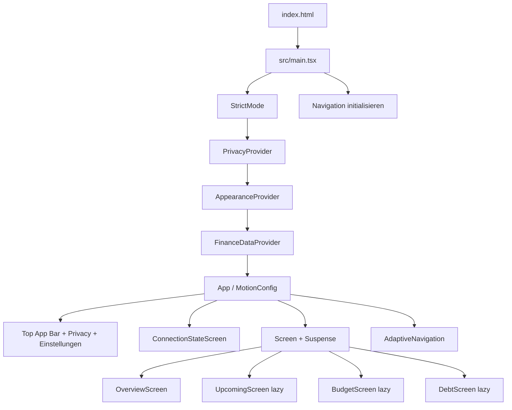

# Frontend-Architektur

> **Zielgruppe:** Frontend-Entwickler.
> **Zweck und Lernziel:** Providerbaum, Navigation, Komponentenrollen, Dialoge, Motion und Responsive Layout nachvollziehen.
> **Voraussetzungen:** [TypeScript und React](../grundlagen/typescript-und-react.md)
> **Kanonisch für:** Frontend-Komposition und Interaktionsarchitektur.
> **Verwandte Dokumente:** [Appearance und Designsystem](appearance-und-designsystem.md), [Tests und Qualität](tests-und-qualitaet.md)

## Mentales Modell

React besitzt Anwendungs- und Interaktionszustand; CSS besitzt Rollen, Geometrie, Farbe, Typografie, Motion, Safe Areas und adaptive Darstellung. Screens komponieren gemeinsame Komponenten, statt eigene Kartendialekte oder Datenberechnungen einzuführen.

## Komponenten- und Providerbaum

Implementierung und Tests: [src/main.tsx](../../src/main.tsx), [src/App.tsx](../../src/App.tsx), [src/data/FinanceDataProvider.test.ts](../../src/data/FinanceDataProvider.test.ts), [tests/visual/finance-ui.spec.ts](../../tests/visual/finance-ui.spec.ts).

## Navigation und Laden

Die zentrale Routendefinition unter `src/navigation/` ordnet `overview`, `upcoming`, `budget` und `debt` den Pfaden `/`, `/demnaechst`, `/budget` und `/schulden` zu. Vor dem ersten React-Render wird der aktuelle Pfad synchron aufgelöst und bei einem einzelnen abschließenden Slash kanonisiert. Unbekannte Pfade werden im bestehenden History-Eintrag auf `/` ersetzt. Eine zusätzliche Router-Abhängigkeit ist für diese vier statischen Ziele bewusst nicht nötig.

Die Hauptnavigation besteht aus echten Links. Unmodifizierte interne Klicks verwenden `history.pushState`; `popstate` bildet Browser- und Android-/PWA-Zurück/Vorwärts wieder auf den React-State ab. Klicknavigation scrollt nach oben, während History-Navigation die browserseitige Scrollwiederherstellung nicht überschreibt. Nach einem Screenwechsel erhält der Hauptbereich weiterhin Fokus ohne Scrollsprung. Budget, Schulden und Demnächst werden mit `lazy`/`Suspense` nachgeladen.

Die URL gilt auch während Connection States. Der zuletzt tatsächlich mit Finanzdaten angezeigte Screen wird als einzelne validierte Destination unter `finance-last-destination-v1` in `localStorage` gespeichert. Dieser Wert wird ausschließlich beim markierten PWA-Kaltstart `/?app-launch=pwa` gelesen; explizite Pfade, Reload und History haben immer Vorrang. Der Marker wird vor dem Rendern durch den kanonischen Zielpfad ersetzt.

Unter 840 Pixeln erscheint eine safe-area-fähige Bottom-Navigation, ab 840 Pixeln dieselbe semantische `nav` als 96-Pixel-Rail. Der DOM-Leseablauf bleibt gleich. Content-Lanes und Grids wachsen an 600-, 840- und 1200-Pixel-Grenzen; 320 Pixel Reflow bleibt ein explizites Qualitätsziel.

## Komponentenrollen

Gemeinsame Rollen sind unter anderem `ScreenHeader`, `FinancialHero`, `AllocationLegend`, `MetricGrid`/`MetricCard`, `SurfaceSection`, `DataList`, `InlineNotice`, `AppButton`, `AdaptiveNavigation`, `AdaptiveDialog`, `FinanceChartTooltip` und `LoadingIndicator`. Screens erhalten fachlich vorbereitete Daten aus dem View-Model und kümmern sich um Präsentationsauswahl sowie lokale Expansion.

## Dialoge und Accessibility

`AdaptiveDialog` und `useModalDialog` kapseln Portal, Fokusbegrenzung, Escape, Scroll-Lock, Fokuswiederherstellung und gestapelte Inertheit. Semantische Buttons und Radio-Controls bleiben nativ. Geldwerte laufen durch `MoneyValue`, damit sichtbarer und zugänglicher Text den Privacy-Zustand gemeinsam respektieren.

## Motion

`MotionConfig reducedMotion="user"` folgt der Betriebssystempräferenz. `ScreenEntrance` animiert einen Screen nur beim ersten committed Besuch einer Tab-Sitzung; besuchte Ziele liegen unter `finance-screen-visits-v1` in `sessionStorage`. Aktualisierung, Theme-Wechsel und Rückkehr spielen die Entrance-Motion nicht erneut. Reduced Motion entfernt Übersetzung, Stagger und Diagrammbewegung.

## CSS-Zuständigkeiten

`src/styles.css` importiert geordnet: `base.css`, `shell.css`, `primitives.css`, `screens.css`, `states.css`, `responsive.css`. Zentrale Designrollen stehen in `src/design/tokens.css`. Screens dürfen Layout komponieren, aber keine neue parallele Tokenwelt schaffen.

## Begründung, Grenzen und Nachweis

Siehe [ADR 0006](../entscheidungen/0006-provider-selektoren-und-view-model.md) und [ADR 0008](../entscheidungen/0008-material-design-und-dynamische-farben.md). Lazy Module brauchen einen Ladefallback; Portals benötigen sorgfältiges Fokusmanagement. URL-Routing persistiert bewusst keine lokalen Unterzustände wie Diagrammauswahl oder aufgeklappte Details.

- Implementierung: [src/components](../../src/components), [src/styles.css](../../src/styles.css), [src/styles](../../src/styles)
- Routing: [src/navigation/appNavigation.ts](../../src/navigation/appNavigation.ts)
- Tests: [src/design](../../src/design), [tests/visual/finance-ui.spec.ts](../../tests/visual/finance-ui.spec.ts)
