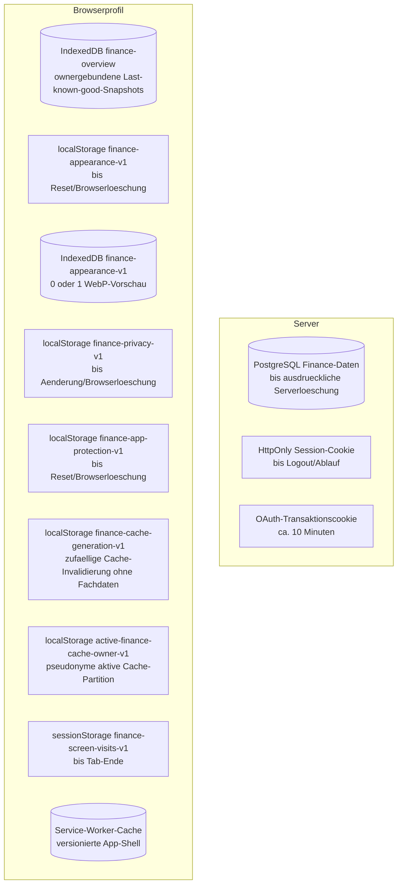

# Synchronisation und Offline

> **Zielgruppe:** Frontend-Entwickler, Betreiber und Support.
> **Zweck und Lernziel:** Cache, Aktualisierungsauslöser, Race-Schutz und Offline-Grenzen nachvollziehen.
> **Voraussetzungen:** [Datenvalidierung und Speicher](../grundlagen/daten-validierung-und-speicher.md)
> **Kanonisch für:** Finance-Synchronisation, Request-Koordination und Last-known-good-Offline-Verhalten.
> **Verwandte Dokumente:** [Abläufe und Zustände](../produkt/ablaeufe-und-zustaende.md), [Backend und Sicherheit](backend-und-sicherheit.md)

## Mentales Modell

Der Server liefert immer einen vollständigen validierten Snapshot. Der Browser ersetzt seinen letzten guten Snapshot nur nach einer erfolgreichen, noch aktuellen Anfrage. Fehler löschen vorhandene Daten nicht; sie markieren sie als veraltet. Offline ist damit ein expliziter Anzeigezustand und kein separater Berechnungsmodus.

## Aktualisierungsauslöser

Synchronisiert wird beim Start mit vorhandener Sitzung, manuell, beim `online`-Ereignis und beim Zurückkehren in den sichtbaren Tab, wenn der letzte Erfolg mehr als zehn Minuten zurückliegt. Es gibt kein Polling, keinen Cron und keinen Push-Kanal.

## Race-Schutz

`refreshPromise` dedupliziert gleichzeitige Refresh-Aufrufe. Eine monoton steigende Generation entwertet Antworten älterer Arbeitsabläufe. `AbortController` beendet Requests beim Provider-Unmount und Logout. Vor und nach dem asynchronen Cache-Schreiben werden Request-, Owner- und Cache-Generation erneut geprüft. So kann eine verspätete Antwort weder eine neue Identität noch Abmeldung oder lokale Datenbereinigung überschreiben.

## Speicherorte und Lebensdauer

Implementierung und Tests: [api/_lib/security.ts](../../api/_lib/security.ts), [src/data/financeCache.ts](../../src/data/financeCache.ts), [src/appearance/wallpaperStore.ts](../../src/appearance/wallpaperStore.ts), [src/privacy/privacyStore.ts](../../src/privacy/privacyStore.ts), [src/privacy/appProtectionStore.ts](../../src/privacy/appProtectionStore.ts), [scripts/offline-smoke.mjs](../../scripts/offline-smoke.mjs).

## Service-Worker-Grenze

Workbox precacht statische HTML-, JavaScript-, CSS-, SVG-, PNG- und WOFF2-Artefakte. Navigation fällt auf `index.html` zurück. `/api/*` ist von diesem Fallback ausgeschlossen und verwendet `NetworkOnly`. Der fachliche Cache liegt separat in `finance-overview`, Object Store `last-good`. Jeder Eintrag trägt einen serverseitig per HMAC aus der verifizierten Google-Subjekt-ID abgeleiteten pseudonymen Owner-Schlüssel und wird nur für exakt diese Partition geladen. Der alte globale Schlüssel `finance-data-v1` wird beim Datenbank-Upgrade gelöscht. Jeder Snapshot wird beim Lesen erneut mit Zod validiert.

## Fehler und Sicherheitsannahmen

Wenn IndexedDB nicht verfügbar ist, funktioniert Online-Nutzung weiter, aber kein fachlicher Offline-Start. Ein Last-known-good-Snapshot kann vertrauliche Finanzdaten enthalten und ist nicht verschlüsselt. Browserbereinigung oder Speicherdruck können ihn entfernen. Beim Start wird online zuerst die Sitzung geprüft und erst danach ausschließlich der zu dieser Identität gehörende Cache geladen; ein vorheriger Owner kann dadurch nicht kurz sichtbar werden. Logout deaktiviert die aktive Cache-Partition, lässt den ownergebundenen Snapshot aber für eine spätere verifizierte Wiederanmeldung bestehen. Ein anschließender Offline-Start zeigt ihn nicht an. Eine vergessene PIN wird nur online zurückgesetzt und löscht Sitzung und sämtliche lokalen Finance-Cache-Partitionen; ohne bestätigte Bereinigung bleibt die Sperre aktiv. Die Recovery rotiert davor die profilweite Cache-Generation. Jeder Sync darf nur mit Owner und Generation seines Starts persistieren, sodass verspätete Antworten anderer Tabs den gelöschten Snapshot nicht wiederherstellen.

## Begründung und Nachweis

Siehe [ADR 0005](../entscheidungen/0005-last-known-good-und-offline.md) und [ADR 0009](../entscheidungen/0009-ereignisgesteuerte-aktualisierung.md).

- Implementierung: [src/data/FinanceDataProvider.tsx](../../src/data/FinanceDataProvider.tsx), [vite.config.ts](../../vite.config.ts)
- Tests: [src/data/FinanceDataProvider.test.ts](../../src/data/FinanceDataProvider.test.ts), [src/data/financeCache.test.ts](../../src/data/financeCache.test.ts), [scripts/auth-sw-smoke.mjs](../../scripts/auth-sw-smoke.mjs)
