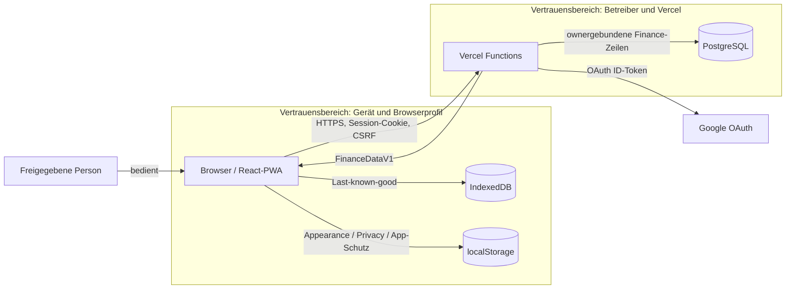

# Architekturüberblick

> **Zielgruppe:** Entwickler und technische Betreiber.
> **Zweck und Lernziel:** Systemteile, Vertrauensgrenzen und Hauptdatenflüsse schnell einordnen.
> **Voraussetzungen:** [Web und PWA](../grundlagen/web-und-pwa.md), [Web-Sicherheit und OAuth](../grundlagen/web-sicherheit-und-oauth.md)
> **Kanonisch für:** Systemkontext, Vertrauensgrenzen und Architektur-Gesamtbild.
> **Verwandte Dokumente:** [Frontend](frontend.md), [Backend und Sicherheit](backend-und-sicherheit.md), [Quellcode-Karte](../referenz/quellcode-karte.md)

## Verbindliche Richtung

PostgreSQL ist die einzige produktive Finanzquelle. Google Sheets bleibt ein einmaliges Importformat. Google OAuth dient nur der Anmeldung. Der vollständige Browservertrag bleibt `FinanceDataV1`; `owner_id` existiert ausschließlich in der Persistenz. Finanzberechnungen und Snapshot-Auswahl bleiben außerhalb von SQL. Verbindlich sind [ADR 0013](../entscheidungen/0013-postgresql-als-finanzquelle.md) und [ADR 0014](../entscheidungen/0014-google-oauth-nur-als-identitaet.md).

## Aktuell implementierter Stand

`accura` besteht aus einer React-PWA im Browser, same-origin Vercel Functions und PostgreSQL. Google ist ausschließlich Identitätsanbieter. Der Server bildet die Sicherheits- und Validierungsgrenze. Der Browser erhält ausschließlich normalisierte Finanzdaten und zeigt daraus abgeleitete View-Models.

## Systemkontext und Vertrauensgrenzen

Implementierung und Tests: [src/main.tsx](../../src/main.tsx), [api/_lib/http.ts](../../api/_lib/http.ts), [api/_lib/financeRepository.ts](../../api/_lib/financeRepository.ts), [scripts/auth-sw-smoke.mjs](../../scripts/auth-sw-smoke.mjs).

## Startvorgang

1. `index.html` stellt Root-Element, Manifest und frühe Theme-Metadaten bereit.
2. `src/main.tsx` registriert den Service Worker und liest Appearance, Privacy und App-Schutz vor dem ersten React-Render, damit weder Theme noch eine konfigurierte Sperre sichtbar nachladen.
3. React mountet unter `StrictMode` die Provider in der Reihenfolge Privacy → Appearance → FinanceData.
4. `FinanceDataProvider` lädt parallel fachlich zuerst den Cache und prüft danach die Sitzung. Eine gültige Sitzung löst einen Finance-Read aus.
5. `App` zeigt eine Verbindungs-/Leerseite oder die vier Ziele. Nur die Übersicht ist initial geladen; weitere Ziele werden lazy importiert.

## Hauptdatenfluss

PostgreSQL → Vercel Function → validiertes `FinanceDataV1` → Provider → Selektoren/View-Model → React-Screen. Nur eine vollständig gültige Antwort ersetzt den Browsercache. Schreibende App-Aktionen betreffen die Sitzung, nicht die Finanzzeilen. Der einmalige Operator-Import schreibt den vollständigen v1-Stand außerhalb der Produkt-UI.

## Architekturentscheidungen

Die Gründe sind in [ADRs](../entscheidungen/README.md) festgehalten. Für die nächste Arbeit sind PostgreSQL als Finanzquelle, Google OAuth nur als Identität, die versionierte Integer-Cent-Domäne, Single-User-Sicherheit und Last-known-good-Offline zentral. ADR 0001 und ADR 0003 erklären nur noch den historischen Ausgangspunkt.

## Grenzen und Sicherheitsannahmen

Das Modell setzt ein vertrauenswürdiges Betreiberkonto, korrekte Secrets, HTTPS sowie ein geschütztes Endgerät/Browserprofil voraus. Lokale Finance-Daten sind weder durch Privacy, App-Schutz noch Appearance verschlüsselt. Es gibt keine Mandantentrennung, weil nur eine Identität erlaubt ist.
