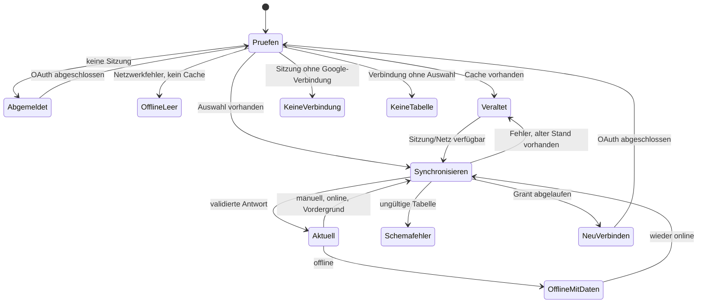

# Abläufe und Zustände

> **Zielgruppe:** Nutzer, Support und Frontend-Entwickler.
> **Zweck und Lernziel:** Sichtbare Zustände, Übergänge und passende Nutzeraktionen unterscheiden.
> **Voraussetzungen:** [Funktionen](funktionen.md)
> **Kanonisch für:** Produktweite Sitzungs-, Sync-, Privacy- und Appearance-Zustandsmatrix.
> **Verwandte Dokumente:** [Synchronisation und Offline](../architektur/synchronisation-und-offline.md), [Fehlerdiagnose](../anleitungen/fehlerdiagnose.md)

## Zustandsmatrix

| Zustand | Sichtbares Verhalten | Nächste Aktion |
| --- | --- | --- |
| Sitzungsprüfung | Ladeansicht „Verbindung wird geprüft“ | abwarten |
| Abgemeldet | Google-Anmeldung wird angeboten | anmelden |
| Google-Verbindung fehlt | gültige Sitzung, aber kein Postgres-Datensatz | neu verbinden |
| Keine Tabelle gewählt | Picker-Aktion, keine Finanzansichten | Tabelle auswählen |
| Picker geöffnet | Auswahl/Prüfung läuft; konkurrierender Sync wird abgebrochen | auswählen oder abbrechen |
| Synchronisierung ohne Daten | Ladeansicht | abwarten |
| Aktuell | Finanzansichten, `stale=false` | normal verwenden |
| Last-known-good/veraltet | alter Stand bleibt sichtbar, Statusbanner warnt | aktualisieren |
| Offline mit Cache | alter Stand bleibt sichtbar | Verbindung wiederherstellen |
| Offline ohne Cache | „Noch kein lokaler Datenstand“ | online erstmals synchronisieren |
| Ungültiges Schema | konkrete Tab-/Zeilen-/Spaltenprobleme | Tabelle korrigieren oder wechseln |
| Autorisierung abgelaufen/widerrufen | „Google erneut verbinden“ | OAuth erneut ausführen |
| Netzwerk-/Serverfehler mit Daten | Daten bleiben sichtbar und als veraltet markiert | später erneut laden |
| Netzwerk-/Serverfehler ohne Daten | zentrale Fehler-/Einrichtungsansicht | Ursache beheben |
| Privacy aus/ein | Geldbeträge sichtbar/maskiert | Umschalter betätigen |
| Appearance-Entwurf | Vorschau im Dialog, noch nicht gespeichert | anwenden oder abbrechen |
| Appearance angewandt | Tokens und optionale Vorschau lokal gespeichert | weiter nutzen/resetten |
| Bild entfernt | Vorschau aus IndexedDB gelöscht; Nicht-Bild-Palette aktiv | neues Bild wählen oder Palette nutzen |

## Sitzungs- und Synchronisierungsautomat

Implementierung und Tests: [FinanceDataProvider](../../src/data/FinanceDataProvider.tsx), [Provider-Tests](../../src/data/FinanceDataProvider.test.ts), [Verbindungsansichten](../../src/App.tsx), [Offline-Smoke-Test](../../scripts/offline-smoke.mjs).

## Abmelden und Trennen

Abmelden löscht nur das signierte Session-Cookie im Browser. Trennen widerruft nach Möglichkeit das Google-Token und löscht selbst bei fehlgeschlagener Widerruf-Anfrage den Verbindungsdatensatz; im Client wird danach der Finance-Cache gelöscht. Appearance und Privacy sind unabhängige Geräteeinstellungen und bleiben in beiden Fällen erhalten.

## Appearance-Transaktion

Der Farben-Dialog hält Modus, Quelle, Palette und Bild zunächst als Entwurf. **Anwenden** validiert und persistiert; **Abbrechen** verwirft den Entwurf. Bei einer Bildquelle wird nur eine reduzierte WebP-Vorschau gespeichert, nie das Original. Wechsel zu System/Presets oder Reset entfernt diese Vorschau.

## Implementierung und Tests

- Reducer und Übergänge: [src/data/FinanceDataProvider.tsx](../../src/data/FinanceDataProvider.tsx)
- Privacy-Tabsynchronisierung: [src/privacy/PrivacyProvider.tsx](../../src/privacy/PrivacyProvider.tsx)
- Appearance-Dialog: [src/components/ColorThemeDialog.tsx](../../src/components/ColorThemeDialog.tsx)
- Zustands-Golden-Screens: [tests/visual/finance-ui.spec.ts](../../tests/visual/finance-ui.spec.ts)
