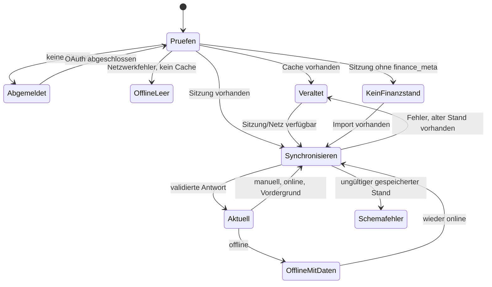

# Abläufe und Zustände

> **Zielgruppe:** Nutzer, Support und Frontend-Entwickler.
> **Zweck und Lernziel:** Sichtbare Zustände, Übergänge und passende Nutzeraktionen unterscheiden.
> **Voraussetzungen:** [Funktionen](funktionen.md)
> **Kanonisch für:** Produktweite Sitzungs-, Sync-, Privacy- und Appearance-Zustandsmatrix.
> **Verwandte Dokumente:** [Synchronisation und Offline](../architektur/synchronisation-und-offline.md), [Fehlerdiagnose](../anleitungen/fehlerdiagnose.md)

## Zustandsmatrix

| Zustand | Sichtbares Verhalten | Nächste Aktion |
| --- | --- | --- |
| Sitzungsprüfung | Ladeansicht „Verbindung wird geprüft“ | abwarten |
| Abgemeldet | Google-Anmeldung wird angeboten | anmelden |
| Finanzstand fehlt | gültige Sitzung, aber kein `finance_meta` | Operator-Import ausführen |
| Synchronisierung ohne Daten | Ladeansicht | abwarten |
| Aktuell | Finanzansichten, `stale=false` | normal verwenden |
| Last-known-good/veraltet | alter Stand bleibt sichtbar, Statusbanner warnt | aktualisieren |
| Offline mit Cache | alter Stand bleibt sichtbar | Verbindung wiederherstellen |
| Offline ohne Cache | „Noch kein lokaler Datenstand“ | online erstmals synchronisieren |
| Ungültiger Finanzstand | generische Integritätsmeldung ohne Werte | Operator-Datenstand prüfen |
| Netzwerk-/Serverfehler mit Daten | Daten bleiben sichtbar und als veraltet markiert | später erneut laden |
| Netzwerk-/Serverfehler ohne Daten | zentrale Fehler-/Einrichtungsansicht | Ursache beheben |
| Privacy aus/ein | Geldbeträge sichtbar/maskiert | Umschalter betätigen |
| App-Vorschau geschützt | gesamte App nach Hintergrundwechsel verdeckt | bewusst Inhalte anzeigen |
| PIN-Lock | Start, Reload oder Hintergrundrückkehr gesperrt | sechsstellige PIN eingeben |
| PIN-Wartezeit | zu viele Fehlversuche; Sperre bleibt aktiv | angezeigte Wartezeit abwarten |
| PIN-Recovery offline/fehlgeschlagen | Sperre und lokale Daten bleiben erhalten | Netzwerk wiederherstellen/erneut versuchen |
| Appearance-Entwurf | Vorschau im Dialog, noch nicht gespeichert | anwenden oder abbrechen |
| Appearance angewandt | Tokens und optionale Vorschau lokal gespeichert | weiter nutzen/resetten |
| Bild entfernt | Vorschau aus IndexedDB gelöscht; Nicht-Bild-Palette aktiv | neues Bild wählen oder Palette nutzen |
| Expliziter App-Pfad | adressierter Hauptscreen nach verfügbarem Datenstand | normal verwenden |
| PWA-Kaltstart | zuletzt verwendeter gültiger Hauptscreen, sonst Übersicht | normal verwenden |
| Ungültiger Pfad | URL wird ohne zusätzlichen History-Eintrag auf `/` ersetzt | Übersicht verwenden |

## Sitzungs- und Synchronisierungsautomat

Implementierung und Tests: [FinanceDataProvider](../../src/data/FinanceDataProvider.tsx), [Provider-Tests](../../src/data/FinanceDataProvider.test.ts), [Verbindungsansichten](../../src/App.tsx), [Offline-Smoke-Test](../../scripts/offline-smoke.mjs).

## Navigation und Wiederherstellung

Explizite Pfade, Reload sowie Zurück/Vorwärts werden immer aus der aktuellen URL bestimmt. Nur der Manifest-Start `/?app-launch=pwa` darf die lokal gespeicherte letzte Destination lesen; der Marker wird dabei per Replace durch den kanonischen Pfad ersetzt. Dadurch bleibt `/` bei normalen Aufrufen eindeutig die Übersicht und die History erhält keinen künstlichen Zwischeneintrag. Lokale Unterzustände innerhalb eines Screens sind nicht Teil dieses Vertrags.

Bei der Google-Anmeldung sendet der Client nur einen der vier kanonischen Pfade als Rückweg. Der Server validiert ihn, bindet ihn an die signierte OAuth-Transaktion und verwendet ihn nach Erfolg oder einem verifizierten Callbackfehler erneut. Nicht erlaubte Werte fallen auf `/` zurück.

## Abmelden

Abmelden löscht das signierte Session-Cookie und deaktiviert die aktive Finance-Cache-Partition. PostgreSQL-Finanzzeilen und der ownergebundene lokale Snapshot bleiben erhalten, werden abgemeldet aber nicht angezeigt. Erst eine erneute verifizierte Anmeldung derselben Identität ordnet diesen Cache wieder zu. Appearance, Privacy und App-Schutz sind unabhängige Geräteeinstellungen. Nur die ausdrücklich bestätigte Recovery einer vergessenen PIN entfernt den lokalen App-Schutz und sämtliche lokalen Finance-Cache-Partitionen nach erfolgreichem Logout; der serverseitige Finanzstand bleibt bestehen.

## Appearance-Transaktion

Der Farben-Dialog hält Modus, Quelle, Palette und Bild zunächst als Entwurf. **Anwenden** validiert und persistiert; **Abbrechen** verwirft den Entwurf. Bei einer Bildquelle wird nur eine reduzierte WebP-Vorschau gespeichert, nie das Original. Wechsel zu System/Presets oder Reset entfernt diese Vorschau.

## Implementierung und Tests

- Reducer und Übergänge: [src/data/FinanceDataProvider.tsx](../../src/data/FinanceDataProvider.tsx)
- Privacy-, App-Schutz- und Lifecycle-Zustand: [src/privacy/PrivacyProvider.tsx](../../src/privacy/PrivacyProvider.tsx)
- Appearance-Dialog: [src/components/ColorThemeDialog.tsx](../../src/components/ColorThemeDialog.tsx)
- Zustands-Golden-Screens: [tests/visual/finance-ui.spec.ts](../../tests/visual/finance-ui.spec.ts)
